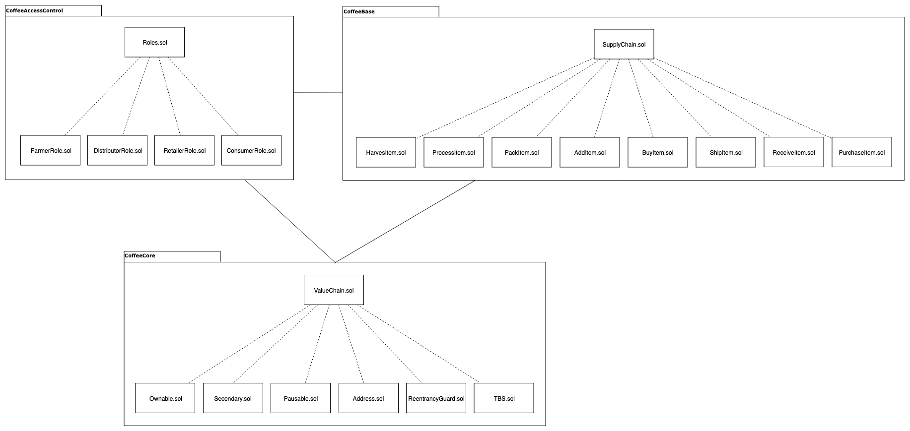

#### version 1.0
# Decentralized Application - Coffee Supply Chain - Demo

## UML Diagrams

### Activity Diagram

### Sequence Diagram

### State Diagram

### Data Model Diagram

## Prerequisites
* Node v8.15.1
* Truffle v5.0.10
* Solidity - ^0.5.7 (solc-js)
* web3 v0.20.7
* openzeppelin-solidity v2.2.0
* truffle-hdwallet-provider 1.0.6
* lodash v4.17.10
* server-static 1.13.2
* connect v3.6.6

## How To Start

## Deployed contract (Rinkeby) 

### Transaction History 

### License
[MIT](LICENSE)
