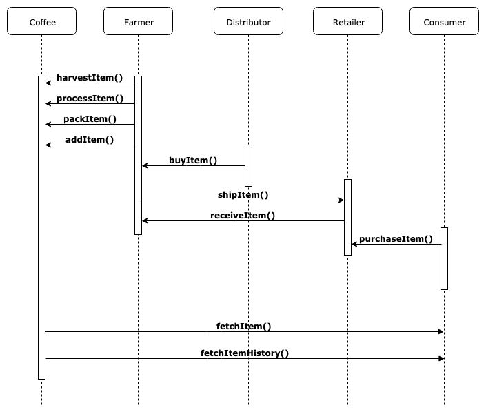
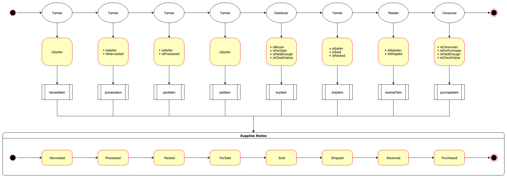

#### version 1.0
# Decentralized Application - Coffee Supply Chain - Demo

## UML Diagrams

### Activity Diagram

### Sequence Diagram

### State Diagram

### Data Model Diagram

## Prerequisites
* Node v10.15.3
* Truffle v5.0.9 (core: 5.0.9)
* Solidity - ^0.4.23 (solc-js)
* Web3.js v1.0.0-beta.37
* lodash v4.17.10
* server-static 1.13.2
* connect v3.6.6

## How To Start
### build contract
1. `make contract-build`
### test contract
1. `make contract-test`
### deploy contract
1. `make contract-deploy`
### start web application
1. `make build`
2. `make start`
3. go to [localhost:8080](localhost:8080)
### If you don't familiar with `make`. Please checkout the [doc](https://www.gnu.org/software/make/manual/make.html).

## Deployed contract (Rinkeby)

### Transaction History
#### FarmerRole
* transaction hash:    0xbf92a7efe50e5898c019dcd7a9b88f49bd6ee0b72c28fa4548fcdfa900b5b325
* contract address:    0xa37373bEBf6a8846Dc3565552B250D02091bE3ba

#### DistributorRole
* transaction hash:    0xa80010de79ad122afaa13f9c14ddcef9c8e8c7916326b5846b80c77cba67206a
* contract address:    0x8469b7E6e1E2903bBf35c732701BFD79328f26c6

#### RetailerRole
* transaction hash:    0x4d4ab0f22843d3292890fddc63d557e2a835a2d88a45b59bc2b1990e1e02548f
* contract address:    0x2773Fdb3700773eB482047DeB20333d945D3d38C

#### ConsumerRole
* transaction hash:    0x17411f37f9eadc19a9cf030780e2bbb18194e1887af14c5d03c26fa4a78aab92
* contract address:    0x9D9393572b9D37D07E104DE1F27fec8eB7936BA1

#### SupplyChain
* transaction hash:    0x3fe64209b5b305e163aa162f7bb0406b26530b3d520eefb8b14eb38636e10e0a
* contract address:    0x2dE4e04efb9cAFaeC7A302A736f1f447C5ef6CC7

### License
[MIT](LICENSE)
